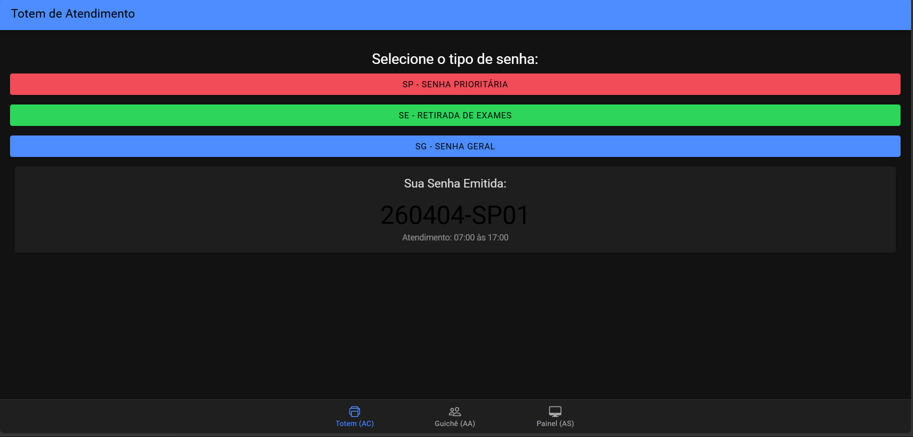
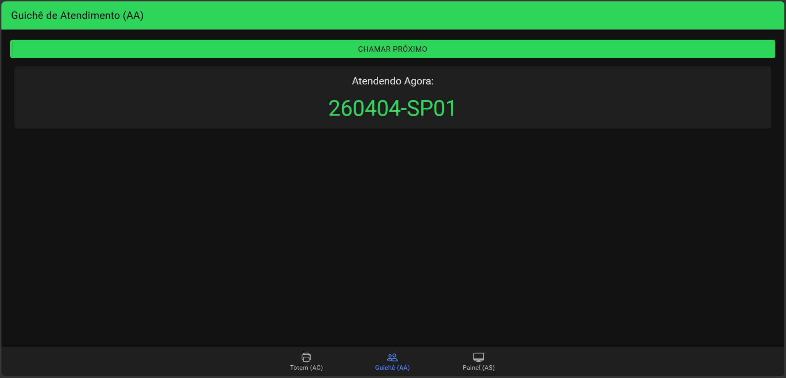
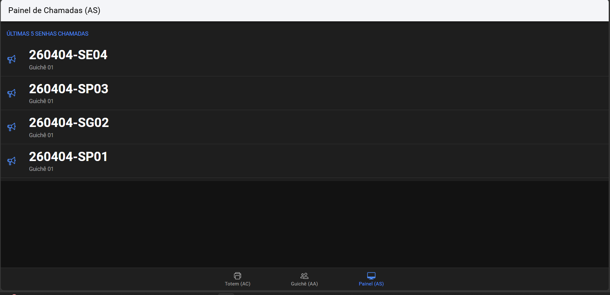

# MobileTicketsIonic
Sistemas de senhas
# MobileTicketsIonic - Sistema de Laboratório

Projeto desenvolvido para a disciplina de Desenvolvimento Mobile (UNINASSAU).

## 🚀 Agentes do Sistema

* **Tab 1 (AC):** Totem de geração de senhas (YYMMDD-PPSQ).
* **Tab 2 (AA):** Painel do Atendente para chamar a próxima senha.
* **Tab 3 (AS):** Painel do Sistema com o histórico das últimas 5 chamadas.

## 📸 Demonstração

## ⚖️ Licença
Este projeto está sob a licença MIT.
